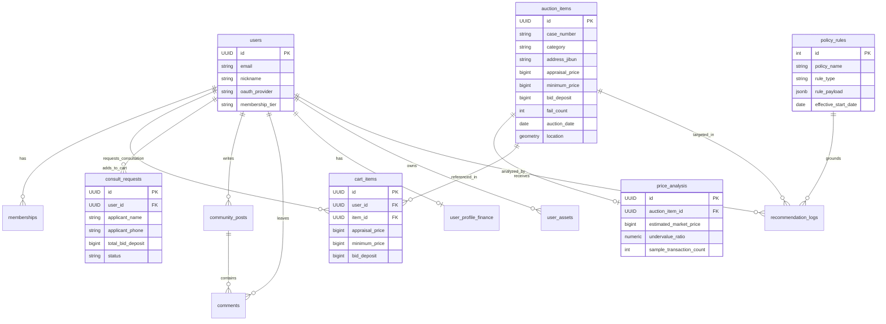

# [Database & Architecture] 기술 스택 및 DB 스키마 설계서
> **문서 버전:** v1.2  
> **기준 문서:** [PRD_부동산경공매정보플랫폼.md](file:///c:/bruce/workspace/my_project/namu-auction/260904/namu-auction/docs/PRD_%EB%B6%80%EB%8F%99%EC%82%B0%EA%B2%BD%EA%B3%B5%EB%A7%A4%EC%A0%95%EB%B3%B4%ED%94%8C%EB%9E%AB%ED%8F%BC.md)  
> **데이터 수집 전략:** 일배치(Batch Synchronization) 기반 공공/외부 데이터 수집 및 정제  
> **최신 갱신일자:** 2026-09-04  
> **운영 법인:** 주식회사 나무 D&C (대표이사: 오세현)  

---

## 1. 기술 스택 선정 및 사유

1. **Frontend (Next.js 16+ App Router, React 19, TypeScript 5, Tailwind CSS v4, Lucide React):**
   - 최신 Next.js Turbopack 엔진을 활용한 초고속 빌드 및 모듈 번들링.
   - 단일 반응형 웹 클라이언트로 데스크톱/모바일을 모두 수용하며, 기본 라이트 모드와 다크 모드 토글 지원.
   - 전역 상태 관리: Context API (`AuthContext` - 4대 소셜 로그인, `CartContext` - 입찰 장바구니).
   - 비주얼: 쇼핑몰형 7:3 와이드 롤링 배너, 아이폰 리퀴드 글래스(Liquid Glass) & 3D 입체 물방울 텍스처.
2. **Backend & DB (NestJS, TypeScript, PostgreSQL 16 + PostGIS 확장, Prisma ORM):**
   - 대용량 물건 및 지도 좌표 반경 검색(ST_DWithin, ST_Within)에 특화된 PostGIS의 공간 인덱스 성능.
   - 모듈형 구조로 4대 소셜 OAuth 인증, 장바구니/일괄상담 API, 일배치 작업 및 외부 API 어댑터 분리에 최적.
3. **Data Pipeline & Batch (NestJS ScheduleModule, BullMQ, Kakao Geocoding):**
   - 온비드/국토부 등 외부 공공 API를 일배치(Daily Cron)로 비동기 큐에서 안정적으로 수집하고, raw 테이블과 정제 테이블을 분리하여 데이터 파이프라인 내구성 확보.

---

## 2. 데이터 수집 파이프라인 구조 (일배치 설계 원칙)

사용자 요구사항인 **"일배치를 통한 데이터 수집"**을 안전하게 수용하기 위해 3계층 데이터 파이프라인을 구축합니다.

```
[외부 데이터 소스]
  ├─ 온비드 공매 Open API (공공데이터포털)
  ├─ 국토부 실거래가 Open API
  └─ 법원경매 데이터 어댑터 (유료 제휴 또는 모의 스펙)
             │
             ▼ (매일 새벽 02:00 ~ 04:00 일배치 수집)
┌─────────────────────────────────────────────────────────┐
│ 1계층: Raw 데이터 보관소 (raw_external_payloads)        │
│ - API 응답 JSON 원본을 timestamp와 함께 그대로 보관      │
│ - 소스 변경/포맷 변경 시에도 데이터 손실 없이 재처리 가능  │
└─────────────────────────────────────────────────────────┘
             │
             ▼ (정제 및 지오코딩 Worker 파이프라인)
┌─────────────────────────────────────────────────────────┐
│ 2계층: 비즈니스 정제 테이블 (Upsert 처리)               │
│ - 주소 기반 카카오 로컬 지오코딩 -> PostGIS POINT(위경도)│
│ - 고유 식별자(사건번호/온비드관리번호) 기준 중복 Upsert  │
│ - auction_items / public_auction_items                  │
│ - molit_real_transactions                               │
└─────────────────────────────────────────────────────────┘
             │
             ▼ (시세 분석 및 AI 추천 연산)
┌─────────────────────────────────────────────────────────┐
│ 3계층: 캐시 및 집계 데이터 (price_analysis / recommendations)│
└─────────────────────────────────────────────────────────┘
```

---

## 3. 핵심 DB 스키마 명세 (PostgreSQL 16 + PostGIS)

### 3.1 사용자 및 인증 관련 테이블 (4대 소셜 OAuth 지원)
```sql
-- 1. 회원 테이블
CREATE TABLE users (
    id UUID PRIMARY KEY DEFAULT gen_random_uuid(),
    email VARCHAR(255) UNIQUE NOT NULL,
    password_hash VARCHAR(255), -- 소셜 가입자는 null 가능
    nickname VARCHAR(50) NOT NULL,
    avatar_url VARCHAR(500),
    oauth_provider VARCHAR(20) DEFAULT 'LOCAL', -- LOCAL, NAVER, KAKAO, GOOGLE, APPLE
    oauth_provider_id VARCHAR(255),
    role VARCHAR(20) DEFAULT 'USER', -- USER, CONSULTANT, ADMIN
    membership_tier VARCHAR(20) DEFAULT 'FREE', -- FREE, STANDARD, PREMIUM
    membership_expires_at TIMESTAMPTZ,
    last_login_at TIMESTAMPTZ,
    created_at TIMESTAMPTZ DEFAULT CURRENT_TIMESTAMP,
    updated_at TIMESTAMPTZ DEFAULT CURRENT_TIMESTAMP
);

-- 2. 멤버십 결제 이력 테이블
CREATE TABLE memberships (
    id UUID PRIMARY KEY DEFAULT gen_random_uuid(),
    user_id UUID NOT NULL REFERENCES users(id) ON DELETE CASCADE,
    tier VARCHAR(20) NOT NULL, -- STANDARD, PREMIUM
    billing_key VARCHAR(255), -- 토스페이먼츠 빌링키
    customer_key VARCHAR(255),
    amount INT NOT NULL,
    status VARCHAR(20) DEFAULT 'ACTIVE', -- ACTIVE, PAST_DUE, CANCELLED
    current_period_start TIMESTAMPTZ NOT NULL,
    current_period_end TIMESTAMPTZ NOT NULL,
    created_at TIMESTAMPTZ DEFAULT CURRENT_TIMESTAMP
);
```

### 3.2 입찰 장바구니 및 일괄 상담/입찰의뢰 테이블 (쇼핑몰 감성 핵심)
```sql
-- 3. 입찰 장바구니 테이블 (물건 담기 및 실시간 보증금 합산)
CREATE TABLE cart_items (
    id UUID PRIMARY KEY DEFAULT gen_random_uuid(),
    user_id UUID NOT NULL REFERENCES users(id) ON DELETE CASCADE,
    item_type VARCHAR(20) NOT NULL, -- AUCTION, PUBLIC_AUCTION
    item_id UUID NOT NULL,          -- auction_items.id 또는 public_auction_items.id
    appraisal_price BIGINT NOT NULL, -- 담을 당시 감정가
    minimum_price BIGINT NOT NULL,   -- 담을 당시 최저매각가
    bid_deposit BIGINT NOT NULL,     -- 필요 입찰보증금 (통상 10%)
    created_at TIMESTAMPTZ DEFAULT CURRENT_TIMESTAMP,
    UNIQUE(user_id, item_type, item_id)
);

-- 4. 원클릭 일괄 상담 / 입찰의뢰 신청 테이블
CREATE TABLE consult_requests (
    id UUID PRIMARY KEY DEFAULT gen_random_uuid(),
    user_id UUID NOT NULL REFERENCES users(id) ON DELETE CASCADE,
    applicant_name VARCHAR(50) NOT NULL,
    applicant_phone VARCHAR(50) NOT NULL,
    total_appraisal_price BIGINT NOT NULL, -- 의뢰 당시 총 감정가 합계
    total_minimum_price BIGINT NOT NULL,   -- 의뢰 당시 총 최저가 합계
    total_bid_deposit BIGINT NOT NULL,     -- 의뢰 당시 총 필요 보증금 (10%)
    items_snapshot JSONB NOT NULL,         -- 의뢰 당시 담긴 물건 목록 스냅샷
    status VARCHAR(20) DEFAULT 'RECEIVED', -- RECEIVED(접수완료), ASSIGNED(전문가배정), IN_CONSULTATION(상담중), COMPLETED(완료)
    user_message TEXT,                     -- 신청자 추가 요청사항
    created_at TIMESTAMPTZ DEFAULT CURRENT_TIMESTAMP
);
```

### 3.3 일배치 Raw 수집 테이블 (데이터 파이프라인 안정성)
```sql
-- 5. 외부 API 원본 수집 보관 테이블 (Raw Lake)
CREATE TABLE raw_external_payloads (
    id BIGSERIAL PRIMARY KEY,
    source_type VARCHAR(50) NOT NULL, -- ONBID, COURT_AUCTION, MOLIT_PRICE
    batch_run_id VARCHAR(100) NOT NULL, -- 실행 회차 UUID
    external_item_id VARCHAR(100), -- 외부 고유 식별자
    raw_json JSONB NOT NULL,
    is_processed BOOLEAN DEFAULT FALSE,
    error_message TEXT,
    created_at TIMESTAMPTZ DEFAULT CURRENT_TIMESTAMP
);
CREATE INDEX idx_raw_source_processed ON raw_external_payloads(source_type, is_processed);
```

### 3.4 경매 및 공매 물건 테이블 (PostGIS 좌표 포함)
```sql
-- 6. 행정구역 코드 (지역 필터 속도 최적화)
CREATE TABLE regions (
    code VARCHAR(10) PRIMARY KEY, -- 법정동/행정동 코드 (예: 1144010100)
    sido VARCHAR(50) NOT NULL,     -- 서울특별시
    sigungu VARCHAR(50) NOT NULL,  -- 마포구
    eupmyeondong VARCHAR(50) NOT NULL, -- 공덕동
    center_location GEOMETRY(Point, 4326) -- 중심 좌표
);

-- 7. 법원경매 물건 정제 테이블
CREATE TABLE auction_items (
    id UUID PRIMARY KEY DEFAULT gen_random_uuid(),
    case_number VARCHAR(50) NOT NULL, -- 사건번호 (예: 2024타경104523)
    item_number INT DEFAULT 1,        -- 물건번호 (다물건 사건 대응)
    court_name VARCHAR(50) NOT NULL,  -- 관할법원 (예: 서울서부지방법원)
    category VARCHAR(50) NOT NULL,    -- 물건종류 (아파트, 다세대, 상가, 토지)
    address_road VARCHAR(255),        -- 도로명 주소
    address_jibun VARCHAR(255) NOT NULL, -- 지번 주소
    building_area_m2 NUMERIC(10, 2),  -- 건물면적 (㎡)
    land_area_m2 NUMERIC(10, 2),      -- 대지권 면적 (㎡)
    appraisal_price BIGINT NOT NULL,  -- 감정평가액
    minimum_price BIGINT NOT NULL,    -- 최저매각가격
    bid_deposit BIGINT NOT NULL,      -- 입찰보증금 (통상 10%)
    fail_count INT DEFAULT 0,         -- 유찰 횟수
    auction_date DATE NOT NULL,       -- 매각기일
    status VARCHAR(30) DEFAULT '진행', -- 신건, 유찰, 낙찰, 변경, 취소
    location GEOMETRY(Point, 4326),   -- WGS84 좌표 (위도, 경도)
    ai_briefing_summary TEXT,         -- AI 요약 브리핑 문구
    created_at TIMESTAMPTZ DEFAULT CURRENT_TIMESTAMP,
    updated_at TIMESTAMPTZ DEFAULT CURRENT_TIMESTAMP,
    UNIQUE(case_number, item_number)  -- 사건번호 + 물건번호 유니크 (Upsert 키)
);

-- 8. 온비드 공매 물건 정제 테이블
CREATE TABLE public_auction_items (
    id UUID PRIMARY KEY DEFAULT gen_random_uuid(),
    cltr_no VARCHAR(50) NOT NULL,     -- 온비드 물건관리번호
    pbct_no VARCHAR(50) NOT NULL,     -- 공고번호
    title VARCHAR(255) NOT NULL,      -- 물건명
    category VARCHAR(50) NOT NULL,    -- 재산종류
    address VARCHAR(255) NOT NULL,
    minimum_bid_price BIGINT NOT NULL,
    appraisal_price BIGINT,
    bid_start_date TIMESTAMPTZ NOT NULL,
    bid_end_date TIMESTAMPTZ NOT NULL,
    org_name VARCHAR(100),            -- 처분기관
    status VARCHAR(30) DEFAULT '진행',
    location GEOMETRY(Point, 4326),
    created_at TIMESTAMPTZ DEFAULT CURRENT_TIMESTAMP,
    UNIQUE(cltr_no, pbct_no)
);
```

### 3.5 실거래가 및 시세분석 테이블
```sql
-- 9. 국토부 실거래가 수집 테이블
CREATE TABLE molit_real_transactions (
    id BIGSERIAL PRIMARY KEY,
    deal_amount BIGINT NOT NULL,      -- 거래금액 (원)
    build_year INT,                   -- 건축년도
    deal_year INT NOT NULL,           -- 거래년도
    deal_month INT NOT NULL,          -- 거래월
    deal_day INT NOT NULL,            -- 거래일
    sigungu_code VARCHAR(10) NOT NULL,
    eupmyeondong VARCHAR(50) NOT NULL,
    complex_name VARCHAR(100),        -- 아파트/단지명
    exclusive_area_m2 NUMERIC(10, 2), -- 전용면적
    floor INT,
    location GEOMETRY(Point, 4326),
    created_at TIMESTAMPTZ DEFAULT CURRENT_TIMESTAMP
);

-- 10. 물건별 AI 시세분석 캐시 테이블
CREATE TABLE price_analysis (
    id UUID PRIMARY KEY DEFAULT gen_random_uuid(),
    auction_item_id UUID UNIQUE REFERENCES auction_items(id) ON DELETE CASCADE,
    estimated_market_price BIGINT NOT NULL, -- 추정 시세
    undervalue_ratio NUMERIC(5, 2),         -- 시세 대비 저평가율 (예: -18.5%)
    sample_transaction_count INT NOT NULL,  -- 분석에 활용된 실거래 건수
    analysis_radius_meter INT DEFAULT 1500, -- 분석 반경 (m)
    std_deviation BIGINT,                   -- 표준편차
    confidence_grade VARCHAR(10) DEFAULT 'B', -- 분석 신뢰도 (A, B, C)
    calculated_at TIMESTAMPTZ DEFAULT CURRENT_TIMESTAMP
);
```

### 3.6 자산관리 & AI 추천 & 정책 룰 엔진 테이블
```sql
-- 11. 부동산 정책 규칙 버전 관리 테이블 (세제, 대출 규제)
CREATE TABLE policy_rules (
    id SERIAL PRIMARY KEY,
    policy_name VARCHAR(100) NOT NULL,     -- 예: '2024 다주택자 취득세 중과 규정'
    rule_type VARCHAR(50) NOT NULL,        -- ACQUISITION_TAX, LTV_LIMIT, REGULATED_AREA
    effective_start_date DATE NOT NULL,    -- 효력 발생일
    effective_end_date DATE,               -- 효력 만료일 (null이면 현재 유효)
    rule_payload JSONB NOT NULL,           -- { "1_house": 0.01~0.03, "2_house_regulated": 0.08, "3_house": 0.12 }
    source_citation VARCHAR(255) NOT NULL, -- 고시/법률 링크 또는 공고번호
    verified_by VARCHAR(50) NOT NULL,      -- 검증한 운영자 계정
    created_at TIMESTAMPTZ DEFAULT CURRENT_TIMESTAMP
);

-- 12. 사용자 재정 프로필
CREATE TABLE user_profile_finance (
    user_id UUID PRIMARY KEY REFERENCES users(id) ON DELETE CASCADE,
    total_net_worth BIGINT DEFAULT 0,     -- 순자산
    available_cash BIGINT NOT NULL,       -- 가용 현금 투자금
    annual_income BIGINT DEFAULT 0,       -- 연소득 (DSR 계산용)
    existing_loan_amount BIGINT DEFAULT 0,-- 기존 대출 잔액
    target_region_code VARCHAR(10),       -- 관심 투자 지역
    investment_goal VARCHAR(30) DEFAULT 'CAPITAL_GAIN', -- 시세차익형, 실거주, 월세형
    updated_at TIMESTAMPTZ DEFAULT CURRENT_TIMESTAMP
);

-- 13. 사용자 보유 부동산
CREATE TABLE user_assets (
    id UUID PRIMARY KEY DEFAULT gen_random_uuid(),
    user_id UUID NOT NULL REFERENCES users(id) ON DELETE CASCADE,
    property_type VARCHAR(30) NOT NULL,   -- 주택, 분양권, 입주권, 상가, 토지
    address VARCHAR(255) NOT NULL,
    is_in_regulated_area BOOLEAN DEFAULT FALSE,
    official_price BIGINT,                -- 공시가격
    estimated_price BIGINT,               -- 시세 추정가
    acquisition_date DATE,                -- 취득일
    mortgage_balance BIGINT DEFAULT 0,    -- 담보대출 잔액
    created_at TIMESTAMPTZ DEFAULT CURRENT_TIMESTAMP
);

-- 14. AI 추천 로그 및 설명 근거 테이블
CREATE TABLE recommendation_logs (
    id UUID PRIMARY KEY DEFAULT gen_random_uuid(),
    user_id UUID NOT NULL REFERENCES users(id) ON DELETE CASCADE,
    auction_item_id UUID NOT NULL REFERENCES auction_items(id) ON DELETE CASCADE,
    score NUMERIC(5, 2) NOT NULL,         -- 종합 추천 점수 (100점 만점)
    reason_undervalue NUMERIC(5, 2),      -- 저평가 기여도 점수
    reason_tax_burden BIGINT,             -- 계산된 예상 취득세액
    reason_loan_available BOOLEAN,        -- 대출 가능 여부
    explanation_text TEXT NOT NULL,       -- 사용자에게 보여줄 추천 사유 브리핑 문장
    policy_rule_id INT REFERENCES policy_rules(id),
    created_at TIMESTAMPTZ DEFAULT CURRENT_TIMESTAMP
);
```

### 3.7 커뮤니티 테이블
```sql
-- 15. 커뮤니티 게시글
CREATE TABLE community_posts (
    id UUID PRIMARY KEY DEFAULT gen_random_uuid(),
    user_id UUID NOT NULL REFERENCES users(id) ON DELETE CASCADE,
    post_type VARCHAR(30) NOT NULL, -- COLUMN, REVIEW, QNA, CASE_LAW
    title VARCHAR(255) NOT NULL,
    content TEXT NOT NULL,
    case_quiz_question TEXT,        -- 판례 퀴즈 질문 (CASE_LAW 타입 시)
    case_quiz_answer TEXT,          -- 판례 정답/해설
    view_count INT DEFAULT 0,
    like_count INT DEFAULT 0,
    is_notice BOOLEAN DEFAULT FALSE,
    created_at TIMESTAMPTZ DEFAULT CURRENT_TIMESTAMP,
    updated_at TIMESTAMPTZ DEFAULT CURRENT_TIMESTAMP
);

-- 16. 댓글 및 Q&A 답변
CREATE TABLE comments (
    id UUID PRIMARY KEY DEFAULT gen_random_uuid(),
    post_id UUID NOT NULL REFERENCES community_posts(id) ON DELETE CASCADE,
    user_id UUID NOT NULL REFERENCES users(id) ON DELETE CASCADE,
    content TEXT NOT NULL,
    is_adopted BOOLEAN DEFAULT FALSE, -- Q&A 채택 여부
    created_at TIMESTAMPTZ DEFAULT CURRENT_TIMESTAMP
);
```

---

## 4. 인덱스 및 공간 쿼리(PostGIS GiST) 최적화 설계

```sql
-- 1. 지도 뷰포트 Bounding Box 검색을 위한 공간 인덱스 (GiST)
CREATE INDEX idx_auction_items_location ON auction_items USING GIST (location);
CREATE INDEX idx_public_auction_items_location ON public_auction_items USING GIST (location);
CREATE INDEX idx_molit_transactions_location ON molit_real_transactions USING GIST (location);

-- 2. 필터 검색 성능 최적화를 위한 복합 인덱스
CREATE INDEX idx_auction_filter ON auction_items (category, status, auction_date, minimum_price);
CREATE INDEX idx_auction_fail_count ON auction_items (fail_count);

-- 3. 풀텍스트 검색 (사건명, 주소, 커뮤니티 검색)
CREATE INDEX idx_auction_address_gin ON auction_items USING gin(to_tsvector('simple', address_jibun || ' ' || COALESCE(address_road, '')));
CREATE INDEX idx_community_search_gin ON community_posts USING gin(to_tsvector('simple', title || ' ' || content));
```

---

## 5. ERD 다이어그램 (Mermaid erDiagram)



---
*본 스키마 문서는 일배치 동기화 모듈(Phase 4)과 NestJS 엔티티/Prisma 마이그레이션(Phase 5)의 기준 스키마로 사용됩니다.*

