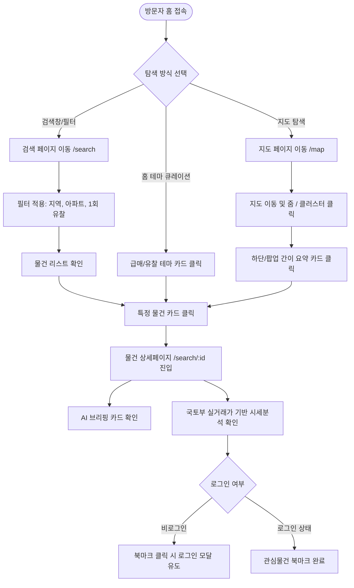

# [IA & User Flow] 정보구조 및 핵심 유저 플로우 설계서
> **문서 버전:** v1.0  
> **기준 문서:** [PRD_부동산경공매정보플랫폼.md](file:///c:/bruce/workspace/my_project/namu-auction/260904/namu-auction/PRD_%EB%B6%80%EB%8F%99%EC%82%B0%EA%B2%BD%EA%B3%B5%EB%A7%A4%EC%A0%95%EB%B3%B4%ED%94%8C%EB%9E%AB%ED%8F%BC.md)  
> **작성일자:** 2026-09-04  

---

## 1. 정보구조 (Information Architecture, IA)

나무옥션은 **단일 반응형 웹 클라이언트(Next.js App Router 기반)**로 데스크톱과 모바일을 모두 지원합니다.

```
나무옥션 (Namu Auction)
├── 1. 홈 (/)
│   ├── 히어로 섹션 (AI 통합 검색바: 사건번호/지역/물건종류)
│   ├── 오늘의 AI 추천 & 급매 테마 큐레이션 (반값 경매, 2회 이상 유찰)
│   ├── 지역별 경·공매 통계 현황 (신건/진행/낙찰가율 요약)
│   ├── 최신 낙찰 성공 후기 미리보기
│   └── 최신 부동산 정책/세제 변경 브리핑 알림
│
├── 2. 경·공매 검색 (/search)
│   ├── 통합 검색 / 경매 탭 / 공매(온비드) 탭
│   ├── 다중 조건 필터 (지역, 물건용도, 감정/최저가, 유찰횟수, 매각기일)
│   ├── 결과 목록 (카드 그리드 뷰 / 리스트 뷰 전환, 무한스크롤)
│   └── 물건 상세 (/search/[id])
│       ├── AI 브리핑 카드 (감정가/최저가/유찰현황 요약)
│       ├── 사진 갤러리 및 현황 위치도
│       ├── 국토부 실거래가 기반 시세분석 리포트 (유사 거래 산출 근거 + 면책 고지)
│       ├── 매각기일 변동 히스토리 & 가격 변동 차트
│       ├── 사건 기본 내역 (물건명세서, 감정평가요약, 등기부 현황)
│       └── 관심물건(북마크) 등록 및 공유
│
├── 3. 인터랙티브 지도 (/map)
│   ├── 전체화면 카카오 지도 (마커 클러스터링)
│   ├── Bounding Box 기반 실시간 물건 렌더링 (Debounce 조회)
│   ├── 지도 상단 필터바 (지역/물건종류/가격대)
│   ├── 마커 클릭 시 바텀 시트 / 간이 팝업 카드 노출
│   └── 관심지역 설정 (신규 물건 등록 알림 연동)
│
├── 4. 투자자 커뮤니티 (/community)
│   ├── 탭 메뉴
│   │   ├── 전문가 칼럼 (인증 전문가 작성)
│   │   ├── 낙찰 후기 (일반회원 실전 경험담, 면책 배너 포함)
│   │   ├── 경공매 Q&A (질문 및 답변 채택)
│   │   └── 법원 판례 아카이브 (판례 퀴즈, 승소/패소 해설)
│   ├── 글 상세 (/community/[id])
│   │   ├── 본문 및 첨부 이미지
│   │   ├── 좋아요, 북마크, 공유, 신고
│   │   └── 댓글 / 대댓글 (Q&A의 경우 답변 채택 버튼)
│   └── 글 작성 (/community/write)
│
├── 5. 멤버십 안내 & 결제 (/membership)
│   ├── 요금제 비교 테이블 (Free / Standard / Premium)
│   ├── 토스페이먼츠 정기구독(빌링키) 결제 연동
│   └── 결제 성공/완료/해지 가이드
│
└── 6. 마이페이지 (/mypage)
    ├── 프로필 및 멤버십 상태 관리
    ├── 관심물건(북마크) 보관함 (매각기일 D-Day 순 정렬)
    ├── 내가 작성한 글 / 댓글 / 채택 내역
    └── 🌟 자산관리 & AI 추천 대시보드 (/mypage/assets)
        ├── 내 자산 브리핑 (보유 주택수, 총자산, 가용 투자금)
        ├── 보유 부동산 등록/수정 모달
        ├── 맞춤형 AI 추천 물건 목록 (추천 사유 + 취득세/대출 시뮬레이션)
        └── 정책 변경 영향도 브리핑 배너
```

---

## 2. 핵심 유저 플로우 3가지 (Key User Flows)

### Flow 1. 신규 방문자의 물건 검색 및 상세페이지 도달 흐름
초보/경력 투자자가 진입하여 원하는 지역/물건을 탐색하고 상세 시세분석 데이터를 확인하는 여정입니다.



---

### Flow 2. 무료 이용자의 유료 멤버십 전환 흐름
무료 회원이 일일 상세 열람 한도(5회)에 도달하거나, AI 정밀 추천/시세분석 심화 데이터를 열람하기 위해 결제하는 과정입니다.

```mermaid
flowchart TD
    User([무료 회원 로그인 이용 중]) --> Trigger{유료 전환 트리거 발생}
    
    Trigger -->|상세 열람 5회 초과| LimitModal[일일 무료 열람 한도 초과 안내 모달]
    Trigger -->|자산관리 AI 추천 클릭| AssetLocked[/mypage/assets AI 추천 잠금 화면]
    Trigger -->|GNB 멤버십 클릭| MembershipPage[/membership 페이지 직접 진입]
    
    LimitModal --> ViewPlans[요금제 비교 화면 표시]
    AssetLocked --> ViewPlans
    MembershipPage --> ViewPlans
    
    ViewPlans --> SelectPlan[Standard 또는 Premium 요금제 선택]
    SelectPlan --> PaymentAuth[토스페이먼츠 카드 등록 / 빌링키 발급 창]
    
    PaymentAuth --> PaymentProcess{결제 승인 처리}
    PaymentProcess -->|성공| SuccessPage[결제 완료 및 멤버십 즉시 활성화]
    PaymentProcess -->|실패| FailRetry[결제 실패 안내 및 카드 재입력 유도]
    
    SuccessPage --> UnlockAccess[모든 제한 해제 및 AI 브리핑 전체 열람]
```

---

### Flow 3. 회원의 낙찰 후기 작성 및 커뮤니티 공유 흐름
실제 경매/공매로 낙찰받은 회원이 자신의 경험을 나누고 커뮤니티 참여도를 높이는 플로우입니다.

```mermaid
flowchart TD
    User([낙찰 경험이 있는 회원]) --> CommPage[커뮤니티 /community 진입]
    CommPage --> WriteBtn[글쓰기 버튼 클릭]
    
    WriteBtn --> AuthCheck{로그인 여부}
    AuthCheck -->|비로그인| LoginRedirect[로그인 페이지 이동]
    AuthCheck -->|로그인| WriteForm[작성 폼: 탭 선택(낙찰 후기)]
    
    WriteForm --> NoticeCheck[투자 면책 문구 고지 확인 및 동의]
    NoticeCheck --> InputDetails[사건번호 매칭 또는 물건 정보 입력]
    InputDetails --> WriteContent[입찰 전략, 명도 후기, 사진 첨부]
    
    WriteContent --> PresignedUpload[S3 Presigned URL 이미지 비동기 업로드]
    PresignedUpload --> SubmitPost[게시글 등록 완료]
    
    SubmitPost --> PostView[게시글 상세 페이지로 이동]
    PostView --> FeedBack[다른 회원들의 축하 댓글 및 좋아요 피드백 수신]
```

---

## 3. 데스크톱 vs 모바일 뷰포트별 UI/UX 차이점 분석

Next.js 단일 반응형 웹 환경에서 뷰포트 크기에 따라 사용자 경험을 최적화하기 위한 핵심 레이아웃 분기 기준입니다.

| 영역 / 기능 | 데스크톱 화면 (Desktop, ≥ 1024px) | 모바일 화면 (Mobile, < 768px) | 설계 및 구현 의도 |
|---|---|---|---|
| **메인 네비게이션 (GNB)** | 상단 고정 헤더 (로고, 메뉴 텍스트 링크, 검색창, 로그인/프로필 버튼) | **하단 5버튼 고정 탭바** (홈, 검색, 지도, 커뮤니티, 마이페이지) + 상단 간이 헤더 | 모바일에서 엄지손가락으로 즉각적인 1-Tap 페이지 전환 지원 (앱 사용성) |
| **검색 필터 패널 (/search)** | **좌측 고정 사이드바 (Width 320px)**<br>항상 펼쳐져 있어 필터 변경 시 우측 리스트 즉시 반응 | **하단 슬라이드업 시트 (Bottom Sheet)**<br>우측 하단 플로팅 '필터' 버튼 탭 시 전체 높이 85%로 오픈 | 모바일 좁은 화면에서 리스트 영역을 온전히 확보하고 필터 시에만 집중할 수 있도록 처리 |
| **지도 UI (/map)** | 좌측 물건 리스트 슬라이딩 패널 (Width 400px) + 우측 대형 지도 분할 레이아웃 | **전체화면 풀스크린 지도** + 하단 스와이프 가능한 캐러셀 미니 카드 | 모바일에서는 지도 조작 공간을 최대로 제공하고 스와이프로 매물 탐색 |
| **물건 상세 레이아웃 (/search/[id])** | 2열 그리드 구조 (좌측: 사진/상세/시세분석, 우측: AI 브리핑 카드 및 입찰 계산기 Sticky 고정) | **1열 수직 스크롤 스택 구조**<br>최상단 AI 핵심 브리핑 카드 → 사진 → 시세분석 순서, 하단 입찰/북마크 고정 액션바 | 모바일에서 스크롤을 내리며 자연스럽게 스토리라인(브리핑 → 상세)을 따라가도록 배치 |
| **자산관리 대시보드 (/mypage/assets)** | 대시보드 3열 카드 그리드 (자산 요약, 정책 알림, 추천 물건 2열 배치) | 단일 열 카드 스택 + 상단 스와이프 가능한 정책 알림 배너 | 시각적 정보 밀도를 낮추고 핵심 수치(취득세, 가용자금)를 크게 강조 |
| **터치 & 인터랙션** | 마우스 호버(Hover) 효과, 세부 툴팁 마우스오버 표시 | 탭(Tap) 인터랙션, 터치 영역 최소 44x44px 보장, Info 아이콘 탭 시 바텀시트 팝업 | 터치 실수 방지 및 모바일 웹 접근성(WCAG) 준수 |

---
*본 문서는 Phase 2.5(UI/비주얼 아이덴티티 및 디자인 토큰 설계)와 Phase 3(DB 스키마)의 직접적인 입력 자료로 사용됩니다.*
