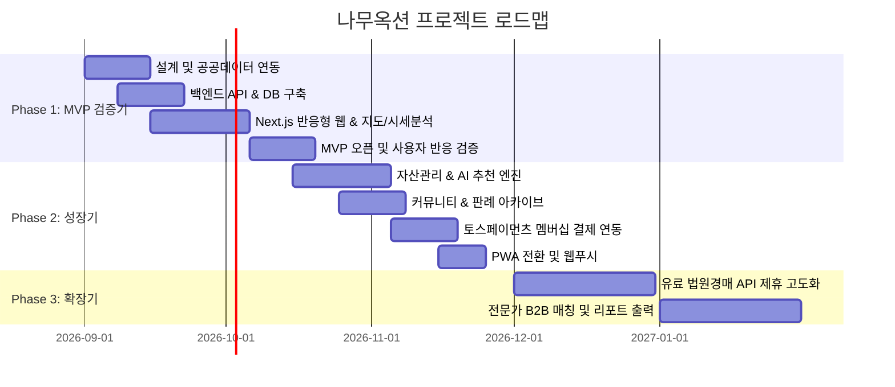

# [PRD] 부동산 경공매 정보 플랫폼 — 나무옥션 (Namu Auction)
> **운영 법인:** 주식회사 나무 D&C (대표이사: 오세현)  
> **문서 버전:** v1.2 (최신 프로토타입 기능 반영 완료)  
> **최신 갱신일자:** 2026-09-04  
> **작성자:** 프로덕트 기획팀 (PM)  
> **문서 목적:** 개발팀, 디자인팀, 운영팀이 즉시 참고할 수 있는 상세 제품 요구사항 명세 및 프로토타입 현행화  

---

## 1. 서비스 개요 (Product Overview)

### 1.1 서비스명 및 슬로건
- **서비스명:** 나무옥션 (Namu Auction)
- **운영사:** 주식회사 나무 D&C (대표이사: 오세현, 본사: 서울시 마포구 마포대로 195)
- **슬로건:** "복잡한 권리분석과 2026 정부 정책 속, 나만의 최적 낙찰 전략 — AI 기반 부동산 경·공매 플랫폼"
- **한 줄 정의:** 대법원 법원경매·캠코 온비드 공매를 통합 검색하고, 국토부 실거래가 기반 저평가 분석과 스트레스 DSR 2단계 등 최신 부동산 정책 맞춤형 자산 시뮬레이션, 이커머스형 입찰 장바구니 및 4대 소셜 간편 로그인을 지원하는 차세대 프롭테크 플랫폼.

### 1.2 기획 배경 및 시장 기회
1. **높은 진입장벽과 정보 비대칭:** 경·공매 시장은 시세 대비 저렴하게 부동산을 취득할 수 있는 기회지만, 난해한 법률 용어, 복잡한 권리분석, 분산된 정보(대법원 경매정보, 캠코 온비드)로 인해 초보자의 접근이 어려움.
2. **이커머스 쇼핑몰형 UX 도입:** 기존 딱딱한 테이블 나열형 사이트와 차별화하여, 헤더 직하단 롤링 프로모션 배너 및 **"경·공매 입찰 장바구니(Cart)"** 시스템을 도입. 사용자가 관심 매물을 담아 총 필요 입찰보증금(10%)을 실시간 시뮬레이션하고 원클릭 일괄 입찰의뢰/상담을 신청할 수 있도록 혁신.
3. **잦은 부동산 규제 및 세제 변동 (2026 최신 정책):** 스트레스 DSR 2단계, 비규제지역 1.1~3.3% 기본세율 vs 다주택자 취득세 중과(8~12%) 룰을 정밀 반영하여, 사용자의 주택 수와 가용 자금에 맞는 맞춤형 매칭 가이드 제공.
4. **접근성 및 감성 극대화:** 
   - **기본 라이트 모드(Default)** + 다크 모드 원클릭 토글.
   - **4대 소셜 로그인:** 네이버, 카카오, 구글, 애플 간편 인증.
   - **아이폰 리퀴드 글래스(Liquid Glass) & 엠비언트 물방울(Dew Droplet) 효과:** 세련된 감성 비주얼 제공.

---

## 2. 타겟 유저 페르소나 (Target Personas)

### 페르소나 1: 초보 투자자 "김새싹" (32세, 직장인)
- **상황/니즈:** 내집마련 또는 소액 시세차익/월세 투자를 원함. 종잣돈 7천만 원~1억 원 보유.
- **페인포인트:** 
  - 권리분석이 두렵고 대출이 얼마나 나오는지, 세금이 얼마나 나올지 계산하기 어려움.
  - 기존 경매 사이트의 용어가 너무 어렵고 UI가 복잡해 어디서부터 봐야 할지 모름.
- **목표:** "내 가용 예산으로 안전하게 입찰할 수 있는 아파트를 AI가 짚어주고, 장바구니에 담아 보증금과 리스크를 알기 쉽게 확인하는 것."

### 페르소나 2: 경력 투자자 "박베테랑" (46세, 자영업자/다주택자)
- **상황/니즈:** 이미 2주택 이상 보유. 급매 수준 이하의 낙찰가율을 보이는 저평가 물건을 지속 발굴하고자 함.
- **페인포인트:** 
  - 취득세 중과(8%~12%) 및 스트레스 DSR 대출 규제로 인해 자금 운용에 제약이 큼.
  - 실거래가 대비 진짜 메리트 있는 물건을 골라내고 포트폴리오를 구성하는 데 시간이 많이 소요됨.
- **목표:** "비규제지역 및 단일세율(4.6%) 오피스텔/상가를 장바구니에 모아 총 보증금을 계산하고, 20% 이상 저평가 매물을 지도에서 즉시 필터링하는 도구."

---

## 3. 경쟁사 대비 핵심 차별화 포인트

| 구분 | 기존 경쟁사 (지지옥션, 굿옥션 등) | **나무옥션 (Namu Auction)** |
|---|---|---|
| **1. UI/UX 패러다임** | 레거시 테이블 텍스트 나열, 데스크톱 중심의 복잡한 그리드 | **쇼핑몰형 롤링 배너 + 입찰 장바구니 + 아이폰 리퀴드 글래스 UI** (라이트 기본 + 다크 모드) |
| **2. 쇼핑몰 인터랙션** | 단순 북마크(찜)에 그침, 자금 합산 기능 부재 | **입찰 장바구니 드로어** (담긴 매물 총 감정가, 총 최저가, 총 필요 입찰보증금 10% 자동 합산 및 일괄 상담 신청) |
| **3. 2026 정책 연동 추천** | 일률적인 물건 나열, 사용자 자산/세금 고려 불가 | **스트레스 DSR 2단계 & 취득세 중과 시뮬레이션** (무주택/1주택 갈아타기/다주택 절세 맞춤 매칭) |
| **4. 간편 인증 체계** | 자체 아이디/비밀번호 가입 강제 | **4대 소셜 로그인 완비** (네이버, 카카오, 구글, 애플 원클릭 시작) |
| **5. 시세 분석 신뢰도** | 단순 호가 제시, 산출 근거 불투명 | **국토부 실거래가 기반 정량 통계 분석** (반경/면적 유사 매물 이상치 제거 및 저평가율 산출) |

---

## 4. 핵심 기능 목록 (MoSCoW 분류 현행화)

### 4.1 Must Have (구현 완료 항목)
1. **홈페이지 헤더 직하단 롤링 프로모션 배너 (`RollingBanner`)**
   - **7:3 황금 분할:** 우측 70% 대형 무손실 아파트 이미지 + 좌측 30% 아이폰 리퀴드 글래스 멘트 카드
   - **무손실 표시:** `object-contain` 갤러리 액자 모드로 아파트 실물 사진(1.jpg~5.jpg) 100% 온전한 비율 유지
   - **아이폰 투명 유리 & 물방울 효과:** 맑은 투명도(`bg-white/[0.08]`) + 표면 림 라이트 반사광 + 입체 이슬 물방울(Liquid Dew Droplets) 디테일
   - **강력한 5대 경매 카피라이팅 탑재 및 자동 슬라이드(4초)**
2. **이커머스 쇼핑몰형 입찰 장바구니 시스템 (`CartDrawer`)**
   - 상단 헤더 장바구니 아이콘 및 실시간 카운트 뱃지 연동
   - 물건 카드 및 상세 모달에서 `[🛒 담기]` / `[✓ 담김]` 원클릭 추가
   - 우측 슬라이드 드로어: 담긴 매물 총 감정가, 총 최저가, **총 필요 입찰보증금(10%) 실시간 자동 계산**
   - `[선택 매물 일괄 입찰의뢰 & AI 상담 신청]` 액션 연동
3. **4대 소셜 로그인 시스템 (`LoginModal`)**
   - 네이버(초록), 카카오(노랑), 구글(4색), 애플(블랙/화이트) 공식 CI 기반 모달
   - 로그인 시 회원명, 등급 뱃지(PRO/VIP) 즉각 헤더 반영 및 로그아웃 지원
4. **경·공매 통합 검색 & 정밀 필터 (`/search`)**
   - 법원경매 및 온비드 공매 통합 검색, 검색어 쿼리(`?q=...`) 연동
   - 다중 조건 필터: 감정가/최저가, 유찰 횟수(신건, 1회, 2회 이상), 지역별, 20% 이상 저평가 필터링
5. **지도 기반 인터랙티브 탐색 (`/map`)**
   - 카카오맵 스타일 지도 + 아파트 핀 마커 및 플로팅 인포윈도우 + AI 상세분석 모달
6. **2026 정부 정책 연동 AI 자산관리 (`/mypage/assets`)**
   - 주택 수, 가용 자금, 연소득 조절에 따른 **스트레스 DSR 2단계 대출 한도 및 취득세율(1.1% vs 8~12%) 자동 계산**
   - 사용자 조건에 최적화된 맞춤 아파트 매물 추천
7. **커뮤니티 & 실전 인사이트 (`/community`)**
   - 4대 게시판(낙찰 성공기, 전문가 칼럼, Q&A, 판례 분석) 및 글쓰기 모달
8. **유료 멤버십 시뮬레이션 (`/membership`)**
   - Free, PRO, VIP 패스 3단계 요금제 비교 및 토스페이먼츠 스타일 카드 정기결제 시뮬레이션
9. **공식 브랜드 푸터 (`Footer`)**
   - "주식회사 나무 D&C", "대표이사: 오세현", 사업자등록번호 및 통신판매업신고, 면책 고지
10. **기본 테마 사양**
    - **라이트 모드(기본 Default)** + 다크 모드 토글 지원, 모바일 하단 5버튼 탭바(`MobileNav`) 라우트 이동 연동

### 4.2 Should Have (성장기 구현 항목)
1. **자산관리 & AI 추천 엔진 (Phase 7.5)**
   - 사용자 자산 프로필 입력 (보유 주택수, 가용 현금, 기존 대출액)
   - 최신 정책 룰(policy_rules) 기반 LTV/DSR 및 취득세 중과율 자동 계산
   - 추천 물건 리스트 + "추천 사유 브리핑"(자연어 텍스트 및 상세 산출 근거 모달)
2. **커뮤니티 생태계**
   - 4개 탭 게시판: 전문가 칼럼, 회원 낙찰후기, 경공매 Q&A(답변 채택), 판례 퀴즈/아카이브
   - 좋아요, 댓글, 조회수, 신고 기능
   - S3 Presigned URL 기반 이미지 첨부
3. **유료 멤버십 & 결제 시스템**
   - 등급: Free(기본 검색) / Standard(월간, 시세분석 무제한) / Premium(연간, AI 추천 및 정책 브리핑)
   - 토스페이먼츠 빌링키 기반 정기 결제 및 결제 실패 유예 처리
4. **모바일 웹 PWA 전환 (Phase 10)**
   - 홈 화면 추가(A2HS), 서비스 워커를 통한 오프라인 캐싱, Web Push 알림

### 4.3 Could Have (확장기 구현 항목)
1. **지도 내 관심구역 드로잉(Polygon) 알림**
   - 사용자가 지도에 다각형을 그리면 해당 구역 신규 매물 등록 시 푸시 알림
2. **등기부등본 및 권리분석 자동 파싱 AI**
   - 말소기준권리 자동 판별 및 인수 권리 경고
3. **전문가 1:1 상담 매칭 (세무사, 법무사, 경매 컨설턴트)**
4. **Capacitor 기반 모바일 앱스토어(AOS/iOS) 패키징 배포**

### 4.4 Won't Have (초기 MVP 배제 항목)
- 자체 법원 현장 조사 대행 서비스 (오프라인 인력 소모 큼)
- 블랙박스 딥러닝 가격 예측 모델 (설명 불가능성 및 법적 리스크)
- 네이티브 앱(React Native/Flutter) 별도 개발 (반응형 웹 PWA로 100% 대체)

---

## 5. 단계별 개발 및 출시 로드맵 (Phased Roadmap)

### 1단계: MVP 검증기 (1~2개월)
- **목표:** 실제 동작하는 경·공매 검색, 지도 탐색, 실거래가 기반 시세분석 무료 서비스 런칭
- **데이터 소스:** 온비드 공공데이터 Open API + 국토부 실거래가 Open API + 법원경매 추상화 어댑터(샘플/모의 데이터)
- **검증 가설:** "기존 사이트 대비 깔끔한 AI 카드형 인터페이스와 모바일 접근성만으로도 사용자 체류시간과 재방문율을 높일 수 있는가?"

### 2단계: 성장기 (3~4개월)
- **목표:** 독점적 킬러 기능(자산관리 AI 추천 엔진) 및 유료 멤버십 도입을 통한 수익화 검증
- **주요 기능:** 맞춤형 추천, 커뮤니티, 토스페이먼츠 정기구독 결제, PWA 웹푸시
- **검증 가설:** "자산 및 정책 시뮬레이션 기반 추천 기능이 유료 멤버십 전환의 결정적 요인이 되는가?"

### 3단계: 확장기 (5개월 이후)
- **목표:** 데이터 유료 공급사(스피드옥션 등) 정식 B2B 계약 체결, 전문가 매칭 및 B2B 컨설턴트 툴 확장
- **주요 기능:** 전문가용 1-Click 입찰분석 리포트 PDF 출력, 법무사/세무사 제휴 수수료 모델

---

## 6. 비즈니스 및 수익화 모델 (Monetization Model)

### 6.1 멤버십 등급 및 가격 정책 (초안)

| 등급 | 가격 | 대상 고객 | 제공 혜택 |
|---|---|---|---|
| **Free (무료회원)** | 0원 | 일반 탐색자, 초보자 | - 경·공매 기본 검색 및 지도 보기 - 일일 상세페이지 열람 5회 제한 - 커뮤니티 글 읽기/작성 |
| **Standard (스타터)** | 월 19,900원 (정가 29,000원) | 실전 입찰 준비자 | - **상세페이지 및 실거래가 시세분석 무제한** - 관심물건 매각기일 D-Day 푸시 알림 - 예상 낙찰가 가이드 제공 |
| **Premium (프로/VIP)** | 월 39,900원 / 연 399,000원 | 다주택 투자자, 전문 컨설턴트 | - **Phase 7.5 자산관리 & AI 맞춤 추천 엔진 무제한** - 세제/대출 정책 시뮬레이터 전체 열람 - 전문가 칼럼 및 판례 해설 전문 열람 - 1-Click 입찰 분석 브리핑 리포트 출력 |

### 6.2 부가 수익원
1. **세무/법무 전문가 매칭 수수료:** 복잡한 특수권리나 절세 상담이 필요한 회원과 검증된 제휴 세무사/법무사를 매칭하고 리드 수수료 수취.
2. **부동산 실전 교육/강의 제휴:** 커뮤니티 내 공신력 있는 경매 강사/학원의 유료 웨비나 홍보 및 수익 쉐어.

---

## 7. 법적/운영 리스크 요인 및 대응 방안 (Risk & Compliance)

### 7.1 데이터 라이선스 및 크롤링 리스크
- **리스크:** 대법원 경매정보 사이트의 대량 무단 크롤링은 웹사이트 이용약관 위반 및 부정경쟁방지법 저촉 소지가 있음.
- **대응책:** 
  - MVP 단계: 캠코 공식 온비드 Open API(공공데이터포털) 적극 활용 + 법원경매는 인터페이스 추상화 어댑터 기반으로 설계.
  - 상용화 단계: 스피드옥션, 지지옥션 등 정식 데이터 공급 계약(B2B Data API) 체결 후 교체 장착.

### 7.2 금융·세무 자문 위반 및 투자 손실 분쟁 리스크
- **리스크:** 특정 물건을 '수익 보장'이라 명시하거나 세금/대출을 단정적으로 확정할 경우 자본시장법, 세무사법, 금융소비자보호법 위반 소지 발생.
- **대응책:** 
  - **카피라이팅 원칙:** "확정 수익", "무조건 이득" 문구 절대 금지. "추정치", "시뮬레이션 기준", "예상 할인율"로 통일.
  - **면책 조항(Disclaimer) 필수화:** 모든 시세분석, 추천, 세제 시뮬레이션 카드 하단에 `"본 정보는 공공데이터 및 정책 기준 시뮬레이션 결과로 법적 효력이 없으며, 최종 입찰 및 세무·대출 여부는 관계 기관 및 전문가 확인이 필요합니다."` 명시.
  - 추천 점수 로직을 딥러닝이 아닌 **투명한 규칙 기반(Rule-based Scoring)**으로 구현하여 근거(저평가율 X%, LTV 한도 내 등)를 투명하게 제시.

### 7.3 정책 변동 데이터 동기화 리스크
- **리스크:** 부동산 규제지역 지정/해제, 취득세율 법 개정 시 시스템이 옛날 룰을 적용하여 오정보를 줄 위험.
- **대응책:** 
  - 정책 테이블(`policy_rules`)에 효력 시작일자 및 고시 출처 링크를 버전별로 관리.
  - 자동 크롤링 대신 운영자 관리자 페이지(Admin)에서 검증 후 승인하는 절차 구축.
  - 정책 기준일자가 90일 이상 경과한 경우 프론트엔드에 `[정책 갱신 검토 중]` 배너 자동 노출.

---

## 8. 핵심 성공 지표 (KPIs)

| 지표 카테고리 | 핵심 지표 (KPI) | MVP 목표치 (런칭 3개월) | 성장기 목표치 (런칭 6개월) |
|---|---|---|---|
| **획득 (Acquisition)** | 신규 가입자 수 (MAU) | MAU 5,000명 | MAU 30,000명 |
| **활성화 (Activation)** | 검색 및 지도 인터랙션 비율 | 방문자의 60% 이상 검색 수행 | 방문자의 75% 이상 검색 수행 |
| **인게이지먼트 (Retention)** | 주간 재방문율 (WAU / MAU) | 25% 이상 | 40% 이상 |
| **관심도 (Engagement)** | 물건 북마크 등록 수 | 회원당 평균 3건 이상 | 회원당 평균 7건 이상 |
| **수익화 (Monetization)** | 무료 -> 유료 멤버십 전환율 | 2.5% 이상 | 5.0% 이상 |
| **안정성 (Reliability)** | 시세/검색 API 응답 속도 (p95) | 500ms 미만 | 300ms 미만 |

---

## 9. 디자인 및 기술 스택 요구조건 요약 (팀 가이드)

### 9.1 디자인 아이덴티티 (Phase 2.5 연계)
- **컨셉:** "차세대 AI 자산관리 비서의 브리핑"
- **톤앤매너:** 신뢰감 있는 다크 챠콜(#0B0F17) 베이스 + 맑은 인디고/에메랄드 포인트 + 정제된 글래스모피즘(Glassmorphism).
- **원칙:** 과도한 네온/사이버펑크 지양, 데이터 중심의 선명한 타이포그래피(Inter + JetBrains Mono)와 절제된 스캔라인 애니메이션.

### 9.2 기술 스택 (Phase 3 연계)
- **Frontend:** Next.js 14+ (App Router), TypeScript, Tailwind CSS, shadcn/ui, Lucide Icons
- **Backend:** NestJS, TypeScript, TypeORM (or Prisma), Swagger
- **Database:** PostgreSQL + PostGIS (공간 좌표 인덱싱)
- **External API:** 카카오맵 SDK, 온비드 공매 Open API, 국토부 실거래가 Open API
- **Deployment:** Vercel (Front) + Docker / Supabase / AWS (Back/DB)

---
*본 문서는 Phase 2 (정보구조 IA 및 유저플로우) 및 Phase 2.5 (디자인 토큰) 설계의 기초 문서로 활용됩니다.*
